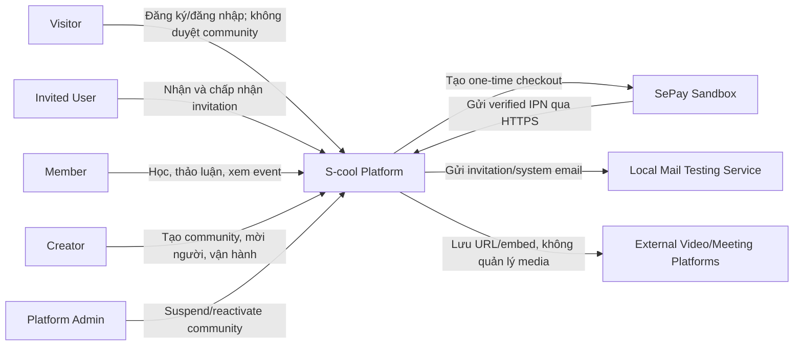
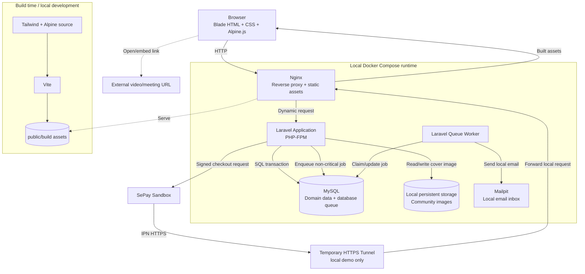
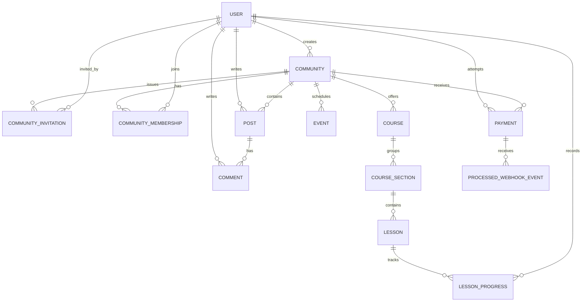
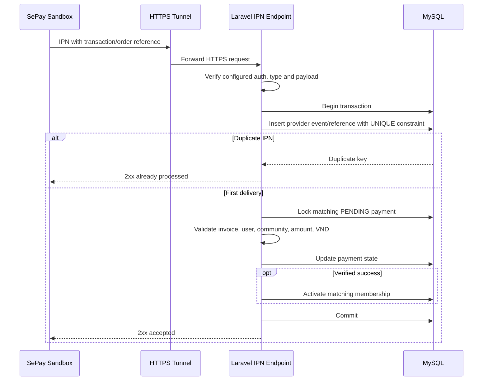

# 02 — Domain & Architecture

> Tài liệu sống: domain model, kiến trúc, workflow trạng thái và trade-off kỹ thuật.  
> Nguồn scope: `01_PRODUCT_SCOPE.md`.  
> Người viết chính: Hoàng  
> Người review: Tiến và Khoa; mentor duyệt các ràng buộc chính  
> Trạng thái: Baseline để bắt đầu implementation  
> Cập nhật: 2026-09-25

## 1. Architecture drivers

### Functional drivers

- Nền tảng multi-community; một user có thể sở hữu và tham gia nhiều community.
- Mọi community là private; membership bắt đầu từ invitation, không từ public discovery/join. Email-bound invitation là baseline đề xuất chờ Hoàng xác nhận trước migration.
- Creator tự vận hành community, không có Community Admin/Moderator trong MVP.
- Feed, classroom, lesson progress và event cùng nằm trong ranh giới community.
- Free membership và paid membership đều yêu cầu invitation; paid flow dùng SePay Sandbox one-time checkout/IPN.
- Platform Admin chỉ quản trị cấp nền tảng và suspend/reactivate community.

### Technical constraints

- Laravel server-rendered application.
- Blade + Tailwind CSS + Alpine.js.
- Vite dùng ở build time; không có frontend server trong production runtime.
- MySQL là database chuẩn của dự án. MariaDB không được support song song trong giai đoạn đầu.
- Local-first; hosting được quyết định sau local readiness gate.
- Payment production, recurring subscription và payout nằm ngoài MVP.
- SePay Sandbox IPN cần HTTPS URL công khai; local demo dùng tunnel có thời hạn, không phải hosting production.

### Quality drivers

1. **Tenant isolation:** không rò dữ liệu hoặc quyền giữa các community.
2. **Correctness:** membership/payment transition phải nhất quán và chống xử lý lặp.
3. **Maintainability:** team ba người hiểu và thay đổi được hệ thống.
4. **Testability:** business rule và authorization có thể kiểm thử tự động.
5. **Reproducibility:** môi trường local, migration và seed có thể tạo lại.

### Baseline kiểm thử, không phải capacity claim

Seed/demo dataset dùng để phát hiện lỗi phân trang và N+1 dự kiến gồm khoảng:

- 100 users.
- 10 communities.
- 500 memberships.
- 1.000 posts/comments kết hợp.
- 20 courses và 100 lessons.
- 100 invitations và 100 SePay Sandbox payment attempts.

Các con số này không phải cam kết tải production. Performance target chỉ được đặt sau khi có workload và phương pháp đo.

### Scope media, realtime và history

- Upload trong MVP chỉ gồm community avatar/cover dạng ảnh tối đa 2 MB.
- Lesson dùng text và external URL/video embed; không upload MP4, MP3, PDF hoặc file học liệu trong MVP.
- Không có realtime chat/feed; browser nhận dữ liệu theo HTTP request thông thường.
- Giữ timestamps, invitation, SePay payment/IPN history và platform-admin actions quan trọng; không xây full audit/event-sourcing system.
- Hỗ trợ responsive web trên các evergreen browser hiện hành; native mobile app nằm ngoài scope.

## 2. Architecture style

### Decision: modular monolith

`ACCEPTED`: S-cool là một Laravel modular monolith, deploy thành một application unit nhưng code được chia theo domain boundary.

Lý do:

- Team ba người không cần chi phí network, distributed transaction và observability của microservices.
- Business transaction giữa payment, membership và community cần tính nhất quán cao.
- Một repository và một release unit giúp local setup, debug và test end-to-end đơn giản.
- Domain boundary vẫn cho phép tách service sau này nếu có tải hoặc ownership thực tế yêu cầu.

Trade-off:

- Không scale từng module độc lập.
- Nếu module phụ thuộc chéo tùy tiện, monolith có thể trở nên khó bảo trì.
- Team phải giữ dependency direction và review boundary trong cùng codebase.

### Cấu trúc code định hướng

- `app/Domain/<Module>`: action/service, enum, business rule và domain-specific code.
- `app/Models`: Eloquent models và relationship.
- `app/Policies`: server-side authorization.
- `app/Http/Controllers`: nhận request, validate, gọi action và trả response; không chứa workflow dài.
- `app/Jobs`: background jobs nhỏ, có retry/idempotency rõ.
- `app/Notifications`: email/in-app notification khi được đưa vào scope.
- `routes/web.php`: browser/Blade routes.
- `routes/api.php` hoặc route riêng: SePay IPN endpoint với middleware/authentication phù hợp.

Đây là hướng tổ chức, không yêu cầu tạo package/module framework riêng.

### Các lựa chọn không dùng trong MVP

| Lựa chọn | Vì sao không dùng | Xem lại khi |
|---|---|---|
| Microservices | Tăng độ phức tạp giao tiếp, transaction, deploy và debug | Một module có nhu cầu scale/ownership độc lập đã đo được |
| Database riêng cho mỗi community | Tăng provisioning, migration, backup và connection management | Có yêu cầu isolation pháp lý hoặc tenant rất lớn |
| SPA/API-first | Blade + Alpine đủ cho interaction hiện tại; SPA tạo thêm auth/state/build complexity | Có mobile client hoặc UX tương tác cao yêu cầu API chính thức |
| Event sourcing/CQRS | Không có yêu cầu replay/audit phức tạp | Business history trở thành yêu cầu cốt lõi |
| Redis bắt buộc | Database queue/cache đủ cho local MVP | Đã đo thấy database queue/cache không đáp ứng |

## 3. System context



Một tài khoản có thể là Creator ở community A và Member ở community B. Video/meeting platform chỉ được tham chiếu qua URL/embed, không phải integration nghiệp vụ sâu.

## 4. Container/runtime architecture ở local



### Runtime components

| Component | Trách nhiệm | MVP | Failure impact |
|---|---|---:|---|
| Browser | Render Blade HTML, compiled CSS và Alpine interactions | Bắt buộc | User không tương tác được |
| Nginx | Nhận HTTP, phục vụ static assets, chuyển request động tới PHP-FPM | Bắt buộc | Web application không truy cập được |
| Laravel/PHP-FPM | Business logic, validation, policy, Blade, webhook | Bắt buộc | Toàn bộ nghiệp vụ dừng |
| MySQL | Domain data, transaction, constraints và database queue | Bắt buộc | Hầu hết nghiệp vụ dừng |
| Queue Worker | Email và side effect không cần giữ HTTP request | Bắt buộc khi job async xuất hiện | Web chính còn chạy; job bị chậm/tồn đọng |
| Local storage | Community avatar/cover | Bắt buộc nếu có upload ảnh | Ảnh không đọc/ghi được; domain data còn nguyên |
| Mailpit | Nhận email local để test | Bắt buộc cho password reset/email flow | Email local không kiểm chứng được |
| Temporary HTTPS tunnel | Expose duy nhất SePay IPN endpoint khi demo local | Bắt buộc cho SePay end-to-end local | App còn chạy; SePay IPN không tới local |
| SePay Sandbox | Checkout/IPN không phát sinh tiền thật | Bắt buộc cho paid flow demo | Free invitation flow còn chạy; paid access không hoàn tất |
| Scheduler | Chưa có scheduled business job trong MVP | Không | Không ảnh hưởng MVP |
| Redis | Chưa có nhu cầu được chứng minh | Không | Không áp dụng |

## 5. Domain modules

| Module | Trách nhiệm | Dữ liệu sở hữu | Không chịu trách nhiệm |
|---|---|---|---|
| Identity | Authentication, profile, password reset, platform role | User, auth/session related data | Community roles, course, payment |
| Communities | Community ownership, private invitation, membership lifecycle, tenant access | Community, CommunityInvitation, CommunityMembership | Post body, lesson content, payment IPN verification |
| Community Content | Feed và creator moderation | Post, Comment | Membership activation, learning progress |
| Learning | Course hierarchy, publishing và progress | Course, CourseSection, Lesson, LessonProgress | Community join, payment |
| Events | Event lifecycle và external meeting URL | Event | Native streaming, RSVP/reminder |
| Billing | SePay Sandbox checkout, payment state, IPN idempotency | Payment, ProcessedWebhookEvent | Production payment, payout, tax, recurring billing |
| Platform Administration | Platform-level visibility, suspend/reactivate community | PlatformAdminAction hoặc security log | Vận hành nội dung thay Creator |

Notifications chưa là module MVP độc lập. Email side effects dùng Laravel notification/job và chỉ tách module khi scope tăng.

### Dependency rules

- Identity không phụ thuộc domain khác.
- Communities phụ thuộc Identity.
- Content, Learning và Events phụ thuộc Communities để kiểm tra tenant/membership.
- Billing phụ thuộc Communities để kích hoạt membership, nhưng Communities không phụ thuộc implementation cụ thể của payment provider.
- Platform Administration gọi policy/action công khai của Communities, không sửa trực tiếp dữ liệu domain tùy ý.
- Module giao tiếp qua action/service hoặc event nội bộ có tên rõ; controller không truy cập chéo nhiều model để tự dựng workflow.

## 6. Domain model

### Entity inventory

| Entity | Ý nghĩa | Tenant-scoped | Lifecycle/owner |
|---|---|---:|---|
| User | Tài khoản dùng chung toàn platform | Không | Identity quản lý; có thể là creator/member ở nhiều nơi |
| Community | Tenant root và không gian học tập | Root | Một `creator_id`; trạng thái ACTIVE/SUSPENDED/ARCHIVED |
| CommunityInvitation | Lời mời một email cụ thể vào private community | Có | Creator tạo/revoke; PENDING/ACCEPTED/REVOKED/EXPIRED |
| CommunityMembership | Quan hệ user–community và access state | Có | Communities quản lý; unique user/community |
| Post | Bài viết feed | Có | Author tạo; author hoặc Creator được xóa theo policy |
| Comment | Bình luận của post | Có | Author tạo; author hoặc Creator được xóa theo policy |
| Course | Nhóm nội dung học | Có | Creator quản lý; DRAFT/PUBLISHED |
| CourseSection | Nhóm lesson có thứ tự | Có | Thuộc Course |
| Lesson | Nội dung text/external embed | Có | Thuộc CourseSection; DRAFT/PUBLISHED |
| LessonProgress | Trạng thái hoàn thành lesson của member | Có | Member tạo/cập nhật; unique user/lesson |
| Event | Hoạt động có thời gian và external URL | Có | Creator quản lý; SCHEDULED/CANCELLED |
| Payment | Một SePay Sandbox payment attempt | Có | Billing quản lý; immutable terminal state |
| ProcessedWebhookEvent | Dấu vết IPN đã xử lý | Theo payment/community | Billing quản lý; SePay transaction/order ID unique |
| PlatformAdminAction | Audit tối thiểu cho suspend/reactivate | Không hoặc tham chiếu community | Platform Administration quản lý |

### Quan hệ mức domain



ERD trên chỉ thể hiện quan hệ chính, không thay thế migration design chi tiết.

### Invariants

1. Một Community có đúng một Creator trong MVP.
2. `communities.slug` duy nhất toàn platform.
3. Một cặp user/community có tối đa một CommunityMembership.
4. Creator ownership lấy từ `communities.creator_id`, không lấy từ client input.
5. Mọi resource tenant-scoped phải thuộc community trong route hiện tại.
6. Member chỉ truy cập nội dung nội bộ khi membership ACTIVE và community ACTIVE.
7. User không có invitation hợp lệ hoặc membership ACTIVE không được biết metadata/nội dung community.
8. Invitation gắn với email normalized, token hash, expiry và community; raw token không lưu/log.
9. Một user có tối đa một LessonProgress cho mỗi lesson.
10. Chỉ lesson PUBLISHED mới nhận progress mới từ member.
11. Success redirect không kích hoạt membership.
12. Một SePay transaction/order event chỉ được xử lý một lần.
13. Payment SUCCEEDED và membership activation được commit trong cùng transaction.
14. Creator không thể sửa trực tiếp Payment terminal state.

## 7. Multi-tenancy và authorization

### Tenant strategy

- Shared database, shared schema.
- Tenant key: `community_id`.
- Tenant root được resolve từ route `/communities/{community:slug}/...`.
- Resource nested phải được scope theo community trước khi policy chạy.
- Không sử dụng một global mutable “current tenant” làm lớp bảo vệ duy nhất.

### Bảng/resource tenant-scoped

- `community_memberships`
- `community_invitations`
- `posts`, `comments`
- `courses`, `course_sections`, `lessons`, `lesson_progress`
- `events`
- `payments`, `processed_webhook_events`

`users` và platform-level security/admin records dùng chung toàn platform.

### Defense in depth

1. **Route/model binding:** nested route và scoped binding ngăn lấy resource ngoài community.
2. **Policies:** kiểm tra actor, ownership, membership state và community state.
3. **Query scope/action:** mọi list/query bắt đầu từ community đã authorize.
4. **Database:** foreign key, unique constraint và index giữ integrity.
5. **Tests:** request thủ công bằng ID/URL community khác phải bị từ chối.

### Authorization matrix

| Action | Visitor | Active Member | Creator | Platform Admin |
|---|---:|---:|---:|---:|
| Discover/view community metadata | Không | Community đã tham gia | Community sở hữu | Danh sách tối thiểu để xử lý sự cố |
| Accept invitation | Đúng email sau login | Nếu invitation còn hiệu lực | Không áp dụng | Không |
| View internal content | Không | Community đã tham gia | Community sở hữu | Không mặc định |
| Create post/comment | Không | Có | Có | Không |
| Edit own post/comment | Không | Có | Có | Không |
| Remove any community content | Không | Không | Có | Không mặc định |
| Manage course/event | Không | Không | Có | Không |
| Manage membership | Không | Chỉ leave bản thân | Có | Không |
| Create/revoke invitation | Không | Không | Có | Không |
| View own SePay Sandbox payment | Không | Có | Có nếu thuộc community | Chỉ khi xử lý sự cố được audit |
| Suspend/reactivate community | Không | Không | Không | Có |

Platform Admin không có blanket bypass cho mọi policy. Quyền đọc dữ liệu nội bộ chỉ được thêm khi có use case xử lý sự cố và phải audit.

### Boundary tests bắt buộc

- Member community A không đọc/tạo resource trong community B.
- Creator community A không sửa/xóa resource của community B.
- Member không sửa post/comment của user khác.
- Suspended/removed/left membership không truy cập nội dung nội bộ.
- Suspended/archived community không chấp nhận hoạt động mới.
- URL/ID giả mạo không vượt qua scoped binding và policy.
- User không có invitation/membership không xem được community metadata bằng slug/ID.
- Invitation sai email, hết hạn, revoked hoặc token đã dùng không tạo membership.
- Platform Admin không tự động có quyền sửa content/course/payment.

## 8. State machines và workflows

### Membership lifecycle

```text
FREE:
NONE --accept valid email-bound invitation--> ACTIVE

PAID VIA SEPAY SANDBOX:
NONE --accept valid invitation/start checkout--> PENDING_PAYMENT
PENDING_PAYMENT --verified SePay IPN success--> ACTIVE
PENDING_PAYMENT --payment failed/cancelled--> PENDING_PAYMENT

ACTIVE --creator suspends--> SUSPENDED
SUSPENDED --creator reactivates--> ACTIVE
ACTIVE/SUSPENDED --creator removes--> REMOVED
ACTIVE --member leaves--> LEFT
```

- FAILED/CANCELLED là trạng thái của Payment, không phải Membership.
- Retry paid checkout tạo Payment attempt mới và tái sử dụng membership PENDING_PAYMENT.
- REMOVED không được tự join lại; Creator phải chủ động cho phép/reactivate theo action được kiểm soát.
- LEFT chỉ có thể tham gia lại bằng invitation mới; paid community yêu cầu paid flow mới vì MVP không có entitlement vĩnh viễn riêng.

### Invitation lifecycle

```text
PENDING --matching email accepts before expiry--> ACCEPTED
PENDING --creator revokes--> REVOKED
PENDING --expires_at passes--> EXPIRED
```

ACCEPTED, REVOKED và EXPIRED là terminal. Gửi lại lời mời tạo invitation mới với token mới.

### Community lifecycle

```text
ACTIVE --Platform Admin suspends--> SUSPENDED
SUSPENDED --Platform Admin reactivates--> ACTIVE
ACTIVE --Creator archives--> ARCHIVED
```

ARCHIVED là terminal trong MVP; không hard delete và chưa hỗ trợ restore.

### SePay Sandbox payment lifecycle

```text
PENDING --verified ORDER_PAID IPN--> SUCCEEDED
PENDING --verified failure/cancel result--> FAILED/CANCELLED
```

SUCCEEDED, FAILED và CANCELLED là terminal. Retry tạo Payment mới.

### Access decision

```text
canAccessInternalContent =
    community.status == ACTIVE
    AND (
        user.id == community.creator_id
        OR membership.status == ACTIVE
    )
```

Với lesson còn phải thỏa `lesson.status == PUBLISHED`. Platform Admin dùng policy riêng, không đi qua biểu thức member/creator này.

### Webhook sequence



Invalid authentication/reference/amount/currency returns an error, changes no membership and logs only safe identifiers.

## 9. Data, transactions và consistency

### M2 implemented contracts (2026-10-07)

- Tables: `community_memberships` has a restrictive community/user FK, state enum,
  unique `(community_id, user_id)` and user/state index. `community_invitations`
  retains creator/accepted-user references, normalized email, state and timestamps;
  `token_hash` is nullable until delivery, then unique SHA-256. Existing applied
  community migrations are unchanged; three forward migrations add this slice.
- HTTP controllers use `CreateInvitation`, `AcceptInvitation`, `RevokeInvitation`.
  Creation/revocation lock the community before the invitation. Acceptance locks
  the fresh user, community and invitation, then commits membership and acceptance
  together. Validity includes verified matching email, live expiry and ACTIVE tenant.
  A used token returns 404 without another membership or restoring revoked access.
  LEFT rejoin requires a new invitation; SUSPENDED/REMOVED/PENDING_PAYMENT cannot
  bypass their state through free acceptance. PAID remains fail-closed until Billing.
- `Community::accessibleTo()` is a paginated list scope, not a blanket authorization
  grant. Owners can see their inactive status; internal view/media require ACTIVE
  tenant plus ownership or ACTIVE membership. Creator-only writes are separate from
  member reads. Nested invitations use scoped route binding and action rechecks.
  Future content/learning/event policies must scope nested resources the same way;
  M2 tests do not certify modules that do not exist yet.
- `SendCommunityInvitation` queues only the record ID, generates a 256-bit token
  in the worker and sends through SMTP. The email link uses a URL fragment;
  Alpine reads it into the POST form in memory and removes it from the address bar.
  GET never grants membership. Raw tokens are not persisted in jobs/models, flashed
  to sessions or included in exception arguments. PHP argument traces are disabled
  at application bootstrap; mail failures are rethrown without sensitive causes.
- Delivery is at-least-once, not exactly-once SMTP. Sending and recording the hash
  occur inside a short locked transaction (SMTP timeout 15 seconds). A delivered
  message followed by a DB commit failure can be followed by a replacement email
  on retry; only the committed hash works. Queue enqueue failure after creation
  leaves a pending record; revoke/reissue or retry a failed job, never reopen a
  terminal record. There is no transactional outbox or automated orphan cleanup.
- Covers use `community_media` at `storage/app/community-media`, outside the default
  local disk root and public web root. It has no signed/public serving route.
  Authorized delivery is private/no-store with nosniff; upload validation checks
  raster MIME, allowed extension, size and dimensions. Generated paths are scoped
  to the tenant. Failed DB writes clean the new file; replacement cleans the old
  file only after commit and rejects foreign references. Failed cleanup is logged
  by tenant ID; filesystem and DB writes cannot be made one atomic transaction.
- Retained membership/invitation references restrict deletion. Profile deletion
  rejects ownership/membership records with clear feedback. State records remain
  rather than being deleted; this slice does not implement a separate audit-history
  event table, member-management UI or account anonymization.

### Transaction boundaries

- Free invitation acceptance: validate/mark invitation + create/activate membership trong một transaction.
- Paid invitation acceptance: validate/mark invitation + create PENDING_PAYMENT membership + payment trong một transaction.
- Paid success: processed IPN + payment transition + membership activation trong một transaction.
- Creator suspend/remove member: membership transition trong một transaction.
- Community suspend: community state update và admin action log trong một transaction.

### Constraints

- `communities.slug` unique.
- `community_invitations.token_hash` unique.
- Index `community_invitations(community_id, normalized_email, status)` phục vụ lookup/revoke; rule invitation active được enforce trong action/transaction phù hợp với MySQL.
- `community_memberships(community_id, user_id)` unique.
- `lesson_progress(user_id, lesson_id)` unique.
- `payments.external_reference` unique.
- `processed_webhook_events(provider, provider_event_id)` unique; SePay order/transaction reference liên quan cũng phải unique theo semantics provider.
- Foreign key cho owner, community, author, parent content và payment relationships.

### Concurrency

- Dùng unique constraints làm lớp bảo vệ cuối cho duplicate invitation acceptance/IPN.
- Lock invitation/payment/membership row khi xử lý competing transition hoặc verified IPN.
- Catch duplicate-key và trả kết quả idempotent thay vì tạo record thứ hai.
- Không dùng check-then-insert thuần túy mà thiếu database constraint.

### Delete và retention

- Community dùng state ARCHIVED; không hard delete trong MVP.
- EUR-21 retention safeguard: `creator_id` is non-null with a restrictive foreign key, not a cascading delete. Profile deletion is refused while a user owns any community, including suspended/archived communities. This prevents account deletion from erasing tenant data; ownership transfer/account anonymization remains outside this slice.
- Membership giữ state history; không xóa khi leave/remove.
- Post/comment dùng soft delete nếu cần creator moderation/history.
- Course/lesson ưu tiên unpublish; soft delete chỉ khi UI cần.
- Payment và processed webhook event không bị sửa/xóa qua UI.
- Demo/local data có thể reset bằng migration/seed command được kiểm soát.

### EUR-21 implementation baseline (2026-10-07)

- Community visibility is fixed to `PRIVATE` at both model/database defaults; the schema does not permit public visibility. Access mode defaults to `FREE`; the schema reserves `PAID` for later explicit configuration/payment work, not entitlement activation.
- Known visibility/access/state values use MySQL enums. This keeps the baseline constrained without a new package; adding a value requires a forward migration. No configurable public directory is introduced.
- Creator ownership is assigned through `User::createdCommunities()`, never request input. Ownership, visibility, access mode and lifecycle state are excluded from model mass assignment.
- Slugs are lowercase ASCII letters/numbers/dashes/underscores, globally unique; `create` is reserved for the form route. Normalize before validation; convert duplicate-insert races into validation feedback. Global slug availability checks are not proof of complete enumeration resistance.
- Creator-only routes return 404 for unauthorized/inactive access. The owned-community list is paginated; it is not a public directory or a member switcher. Membership-derived access, protected media and complete M2 isolation remain EUR-22 through EUR-25 work.
- The initial migration was uncommitted and pending on the local development DB before audit, so its schema was corrected before application. It has now been applied locally; all subsequent schema changes require forward migrations, not edits to this migration.

### Audit/history

- Mọi entity có timestamps.
- Payment lưu state, SePay order/transaction reference, safe IPN identifiers và thời điểm xử lý.
- Platform Admin suspend/reactivate lưu actor, community, action, timestamp và reason ngắn.
- Không ghi password, token, full webhook secret, payment credential hoặc sensitive payload vào log.

### Time

- Lưu datetime ở UTC.
- Event có timezone IANA do Creator chọn để hiển thị đúng cho member.
- UI chuyển đổi timezone ở presentation layer; database không lưu nhiều bản cùng một thời điểm.

## 10. File và media

- MVP chỉ upload community avatar/cover.
- Cho phép JPEG, PNG và WebP; tối đa 2 MB/file.
- Server kiểm tra MIME thực và kích thước, không chỉ extension.
- Server tạo tên file; không dùng trực tiếp tên do user cung cấp.
- Vì community là private, cover không được lộ qua đường dẫn public cố định. MVP phục vụ ảnh qua route đã authorize hoặc signed temporary URL; không đặt cover vào public disk không kiểm soát.
- Lesson video dùng allowlisted HTTP(S) URL/embed; không upload hoặc proxy media.
- PDF, MP3, MP4, ZIP và lesson attachment nằm ngoài MVP.
- Khi cover được thay thế, file cũ được cleanup sau khi database update thành công; lỗi cleanup được log để xử lý sau.

## 11. Queue, notification và scheduled jobs

| Job | Lý do async | Retry | Idempotency | Failure handling |
|---|---|---|---|---|
| Password reset/system email nếu được queue | Không giữ HTTP request | 3 lần với backoff | Notification key theo user/purpose khi cần | Lưu `failed_jobs`, xem trong local ops |
| Invitation email | Không giữ request tạo invitation | 3 lần với backoff | Invitation ID + notification type | Invitation còn hợp lệ; retry email độc lập |
| Payment success email | Side effect sau transaction; không ảnh hưởng quyền | 3 lần với backoff | Payment ID + notification type | Membership giữ nguyên; retry email độc lập |

- Queue driver local: `database`.
- Payment/membership state update không đẩy sang queue trong MVP; xử lý đồng bộ, transactional và idempotent trong SePay IPN request.
- Scheduler chưa có job bắt buộc. Chỉ thêm khi có cleanup/reminder thật sự thuộc scope.
- Redis không phải dependency MVP.

## 12. Security baseline

### Authentication và session

- Laravel session-based authentication.
- Password hash dùng Laravel-supported secure default.
- Session cookie `HttpOnly`, `SameSite` phù hợp; `Secure` bắt buộc khi có HTTPS.
- Password reset token có thời hạn; email được kiểm thử qua Mailpit ở local.
- Platform Admin role không nhận từ form/mass assignment.

### Authorization

- Laravel Policies cho Community, Post, Comment, Course, Lesson, Event, Membership và Payment.
- Mọi write action authorize ở server.
- Scoped route binding và community-first query chống IDOR.
- Không coi việc ẩn button Alpine/Blade là kiểm soát quyền.

### Input/output protection

- Form request validation và explicit allowlist field.
- CSRF middleware cho web forms.
- Blade escaped output mặc định; rich HTML không nằm trong MVP.
- Eloquent/query builder parameter binding; không ghép raw SQL từ input.
- Rate limit login, password reset, invitation acceptance và SePay IPN endpoints.

### File và secret

- Validate MIME/size và tạo server-side filename cho cover image.
- `.env` và credentials không commit.
- SePay Sandbox merchant/secret/IPN credential chỉ nằm trong environment configuration.
- Log redaction cho Authorization header, cookie, reset token, signature, password và sensitive payload.

### Dependency và threat review

- Composer/npm lockfiles bắt buộc.
- CI chạy dependency audit; finding nghiêm trọng chặn merge hoặc phải có documented exception.
- Khoa dẫn threat review tập trung vào private-community enumeration, invitation token leak/replay, IDOR, privilege escalation, CSRF, stored XSS, mass assignment, IPN spoof/replay, upload bypass và secret exposure.

## 13. Quality attributes và trade-offs

| Thuộc tính | Mục tiêu đủ dùng | Thiết kế hỗ trợ | Trade-off chấp nhận |
|---|---|---|---|
| Maintainability | Feature thay đổi không yêu cầu sửa nhiều module không liên quan | Domain boundaries, thin controller, actions/policies, review dependency | Một deploy unit; không scale module độc lập |
| Security | Tenant isolation và least privilege có test | Scoped routes, policies, constraints, audit admin action | Platform Admin support access bị giới hạn |
| Reliability local | Fresh setup và golden flow tái lập | Docker Compose, migrations, seed, transactions, idempotency | Chưa chứng minh HA/production uptime |
| Performance | Tránh lỗi rõ như N+1 và list không phân trang | Pagination, eager loading, query indexes, baseline dataset | Không tối ưu sớm hoặc đặt SLO giả |
| Testability | Business transition và policy test độc lập | Fake gateway trong automated tests, SePay Sandbox integration test, factories, deterministic seed | Chấp nhận thêm abstraction ở Billing boundary |
| Operability | Nhìn thấy lỗi app, queue và IPN | stdout logs, failed_jobs, safe event history, health route | Chưa có full metrics stack ở local MVP |

## 14. Architecture decisions

### ADR-001 — Modular monolith

- Status: Accepted
- Decision: Một Laravel application/deployment unit với logical domain modules.
- Consequence: Đơn giản local/deploy; team phải kiểm soát coupling trong code review.
- Revisit: Khi có module cần scale/ownership độc lập đã được đo.

### ADR-002 — Shared-schema multi-tenancy

- Status: Accepted
- Decision: Một MySQL database, tenant root là Community, tenant key là `community_id`.
- Consequence: Vận hành đơn giản; authorization và scoped query là rủi ro trọng yếu.
- Revisit: Khi có yêu cầu isolation pháp lý hoặc tenant scale đặc biệt.

### ADR-003 — Creator ownership trực tiếp

- Status: Accepted
- Decision: `communities.creator_id` xác định Creator; không có community role hierarchy trong MVP.
- Consequence: Policy đơn giản; chưa hỗ trợ đồng sở hữu/chuyển quyền.
- Revisit: Khi thêm Community Admin/Moderator hoặc ownership transfer.

### ADR-004 — Membership-derived access

- Status: Accepted
- Decision: Quyền nội bộ suy ra từ community state + creator ownership hoặc ACTIVE membership; không tạo entitlement table riêng.
- Consequence: Ít state hơn; recurring plan/course-level entitlement phải thiết kế lại sau.
- Revisit: Khi có tier, subscription, private course hoặc bundle.

### ADR-005 — SePay Sandbox payment adapter

- Status: Accepted
- Decision: Billing phụ thuộc `PaymentGateway` contract; luồng demo dùng SePay Sandbox, automated tests dùng fake adapter. Membership chỉ active từ verified IPN.
- Consequence: Có provider-specific integration mà không chạm tiền thật; local end-to-end cần HTTPS tunnel và sandbox credentials.
- Revisit: Trước khi chuyển SePay Production hoặc thêm provider khác.

### ADR-006 — External media

- Status: Accepted
- Decision: Lesson lưu external URL/embed; S-cool chỉ upload cover image.
- Consequence: Hạ tầng nhẹ; phụ thuộc availability/quyền embed của bên ngoài.
- Revisit: Khi native media trở thành yêu cầu đã được chứng minh.

### ADR-007 — Database queue, không Redis

- Status: Accepted
- Decision: Dùng MySQL database queue cho side effects nhỏ; Redis và scheduler không bắt buộc.
- Consequence: Ít dependency local; throughput queue giới hạn hơn Redis.
- Revisit: Khi có queue backlog/latency được đo hoặc cần realtime/cache chuyên dụng.

### ADR-008 — Private email-bound community invitation

- Status: Proposed — Hoàng xác nhận trước migration
- Decision: Community không public/discoverable; Creator mời email cụ thể bằng token một lần có expiry/revoke.
- Consequence: Giảm exposure và đúng mô hình nhóm riêng; tăng invitation lifecycle/email flow và không có organic discovery.
- Revisit: Chỉ khi mentor/product owner thay đổi rõ privacy/legal boundary.

## 15. Architecture completion checklist

- [x] System context.
- [x] Container/runtime diagram local.
- [x] Domain modules và dependency rules.
- [x] Domain ERD mức khái niệm.
- [x] Multi-tenancy strategy.
- [x] Authorization matrix và boundary tests.
- [x] Invitation/membership/community/payment state machines.
- [x] SePay Sandbox IPN sequence.
- [x] Data consistency và transaction boundaries.
- [x] Security baseline.
- [x] Architecture decisions.
- [ ] Migration-level schema và index được xác nhận khi implement từng vertical slice.
- [ ] Threat review của Khoa được ghi nhận trước local readiness gate.
